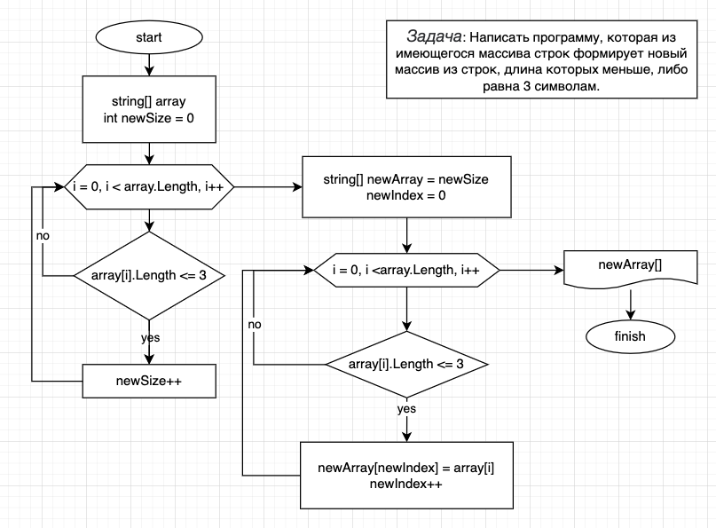

# Описание решения задачи для формирования нового массива строк из заданного массива

## Задача

Из имеющегося массива строк необходимо сформировать выбрать элементы, длина которых 3 или менее символов, и из этих элементов создать новый массив строк.

## Решение

Для решения необходимо получить изначальный массив **array** типа **string**. В рамках данного решения он задаётся в коде программы.

Далее необходимо определить размерность нового массива данных. Для этого создаётся переменная **newSize**, изначально равная нулю, и в цикле перебираются все элементы исходного массива **array**. Если количество символов элемента массива меньше или равно 3, значение **newSize** увеличивается на 1.

Затем создаётся массив **newArray**, который должен будет выведен в консоль, с длиной массива, равной значению **newSize**. А также необходимо задать переменную **newIndex**, изначально равную нулю, для обозначения индекса нового массива.

Теперь необходимо ещё раз в цикле перебираются все элементы исходного массива **array**, и если количество символов элемента массива меньше или равно 3, его значение записывается в текущий элемент нового массива **newArray**, а значение **newIndex** увеличивается на 1.

### Данное решение можно представить в виде диаграмы:



### Пример вывода программы:

```
Initial array:
[0] : Hello
[1] : ;-D
[2] : 123
[3] : Very good
[4] : 5

Elements with 3 symbols or less:
[0] : ;-D
[1] : 123
[2] : 5
```